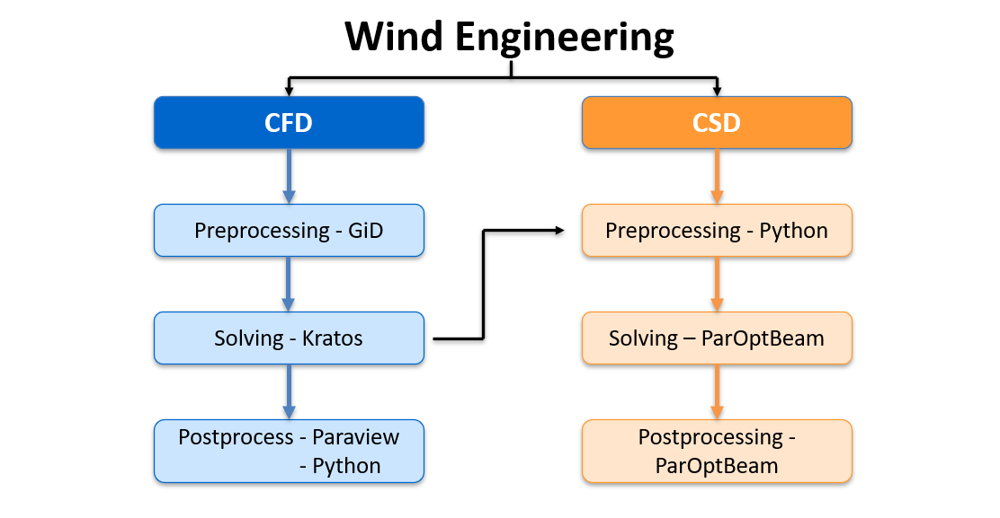

# Hitchhikers Guide to the Structural Wind Engineering Course
## Table of content

[1. Installation Guides](pages/Kratos/Workshops/Hitchhiker_Guide_SWE/Installation%20Guides)

[2. Preprocessing](pages/Kratos/Workshops/Hitchhiker_Guide_SWE/Preprocessing.md)

[3. Solving](pages/Kratos/Workshops/Hitchhiker_Guide_SWE/Simulation_setup_and_run.md)

[4. Postprocessing](pages/Kratos/Workshops/Hitchhiker_Guide_SWE/Postprocessing.md)

[5. ParOptBeam Guide](pages/Kratos/Workshops/Hitchhiker_Guide_SWE/ParOptBeam_Guide.md)

## Overview

The Hitchhiker's Guide provides a valuable resource for student groups involved in the Structural Wind Engineering (SWE) project, assisting them with the technical aspects of the project. The guide is organized in a mostly chronological order, following the project steps. It is recommended to begin by reviewing the Installation Guides to ensure all necessary tools for the project are set up. Since wind engineering is a multiphysics problem, the computational analysis of a building subjected to wind load primarily involves Computational Fluid Dynamics (CFD) and Computational Structural Dynamics (CSD). As this project work focuses on one-way coupling, we perform CFD follwed by CSD. Genrally, a computational simulation consists of three main stages:

1. Preprocessing
2. Solving
3. Postprocessing

These steps will be carried out both for CFD and CSD. 

# CFD

## 1. Preprocessing

Preprocessing involves preparing the input data required for the simulation. For this project, this data consists of the mesh details for the fluid domain and its the project parameters, which are obtained using GiD. GiD is a licensed software that will be provided during the course. [Installation Guides](pages/Kratos/Workshops/Hitchhiker_Guide_SWE/Installation%20Guides/GiD.md). Preprocessing with GiD is explained in [Preprocessing](pages/Kratos/Workshops/Hitchhiker_Guide_SWE/Preprocessing.md)

## 2. Solving

KratosMultiphysics an open-source multiphysics software developed by CIMNE (International Center for Numerical Methods in Engineering) will be used as solver. Kratos has several applications such as Fluid Dynamics, Structural Mechanics, and Optimization. In this project, the Fluid Mechanics Application of Kratos will be used for CFD simulations - [KratosMultiphysics Installation Guides](pages/Kratos/Workshops/Hitchhiker_Guide_SWE/Installation%20Guides/Kratos_with_Python.md). For more information about Kratos and its use cases - [Kratos Documentation](https://kratosmultiphysics.github.io/Kratos/). Solver information for Kratos relating to this project is explained in [Solving](pages/Kratos/Workshops/Hitchhiker_Guide_SWE/Solving.md)

## 3. Postprocessing

Postprocessing involves visualizing and interpreting the numerical results obtained from the solvers. ParaView, an open-source visualization software, will be used to postprocess the results generated by Kratos - [ParaView Installation Guides](pages/Kratos/Workshops/Hitchhiker_Guide_SWE/Installation%20Guides/Paraview.md). Postprocessing in ParaView is explained in [Postprocessing](pages/Kratos/Workshops/Hitchhiker_Guide_SWE/Postprocessing.md)

# CSD

## 1. Preprocessing

The results from Fluid solver(Kratos) will be processed with python and given as input to CSD Solver. 

## 2. Solving

ParOptBeam (Parametrical Optimizable Beam) is a program from the Chair of Structural Analysis will be used as CSD solver. Using this program, the user can run eigenvalue, static and dynamic analysis of a finite element (FE) beam model. - [ParOptBeam Installation Guides](pages/Kratos/Workshops/Hitchhiker_Guide_SWE/Installation%20Guides/ParOptBeam.md)

## 3. Postprocessing

A separate postprocessing tool is not required for ParOptBeam, as the program itself produces directly interpretable outputs. All infromation regarding CSD is explained in [ParOptBeam Guide](pages/Kratos/Workshops/Hitchhiker_Guide_SWE/ParOptBeam_Guide.md)

