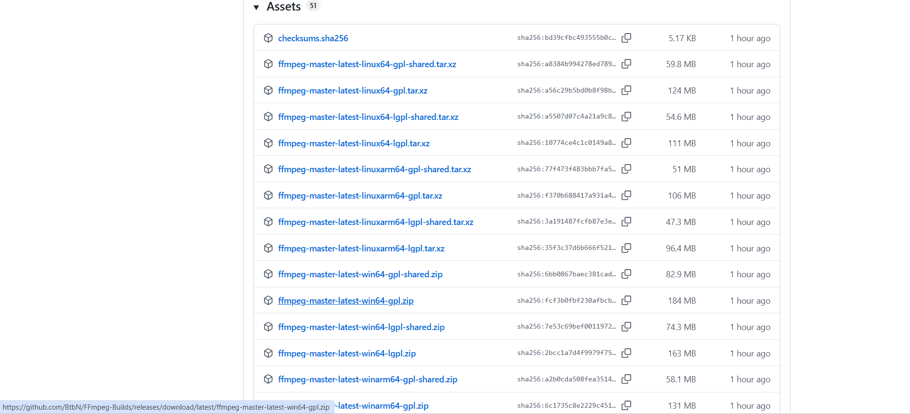

# FFMPEG 
FFmpeg is a multimedia framework that can be used for various operations in numerous media files. FFMPEG is necessary for the Beam Model in the Project Work when using ParOptBeam as well as for some of the Jupyter Notebooks offered during the course.

## Download and Install FFMPEG
FFmpeg is available for [download here](https://www.ffmpeg.org/download.html).





### 1. For Windows:

Hover your mouse on the Windows symbol. Click on **"Windows builds by BtbN"**.

When located in the new website, select **"ffmpeg-master-latest-win64-gpl.zip"**. Make sure to have a program to extract the contents of ffmpeg. After extracting the content of ffmpeg, rename it to FFmpeg. Save ffmpeg in a directory of your choice, for example under local disk C:\ .

Next step is to add ffmpeg to your path. Go to **Start menu &rarr; search for "Edit the system environment variables"**. Click on **"Environment Variables"**. Under **"User variables for ..."** find **"Path"** and click on **Edit**. Add a new path which would be the path in which your FFmpeg is, followed by ```\bin```. For example, if your FFmpeg folder is saved as FFMPEG under local disk C:\ the path would be ```C:\FFMPEG\bin```. After adding **FFmpeg** to your system PATH, you can verify the installation by running the following command in your terminal or command prompt:

```bash
ffmpeg -version
```

If installed correctly, this will display the FFmpeg version and configuration details.

### 2. For Linux:
In ubuntu, start by updating the packages list:

```shell
$ sudo apt update
```

Next, install FFmpeg by typing the following command:

```shell
$ sudo apt-get install ffmpeg
```

Verify your installation using:

```shell
$ ffmpeg -version
```
