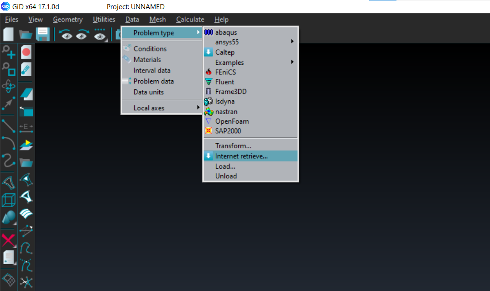

# GiD and Kratos Problem Type
GiD and the Kratos problem type for GiD will be used during the project work for the CFD simulation of the structure. GiD supports the geometrical modelling of the structure, meshing, boundary conditions, system properties, etc. Kratos is used as a solver, from which we receive our results. It is a multi-physics simulation code. Aside from CFD, GiD + Kratos might also be used for other purposes, such as Structural/Dynamic Analysis, Fluid-Structure-Interaction etc. Kratos problem type in GiD add some features to support Kratos in GiD, which will generate the input for the solver.

## Installation
### 1. Install GiD:
[Download GiD at their website](https://www.gidsimulation.com/gid-for-science/downloads/), choose your operating system and download *“GiD 16.1.2d 64 bits"*. Then click on downloaded the executable to install it.

In order to use GiD, you will need to activate a professional license, as the free license is limited. You will be provided with access to this license during the course. After registering, open GiD and go to **" Help &rarr; Register GiD &rarr; Named user &rarr; sign in"**. To sign in, put your TUM email adress and password you used during registration.

### 2. Install Kratos Problem Type: 
Open GiD and click on `“Data/Problem Type/Internet retrieve”`. Then select Kratos Multiphysics 9.2.0 and click on “Retrieve module”.

Follow [this example](pages/Kratos/Workshops/Hitchhiker_Guide_SWE/Installation Guides/Testing_Kratos_Installation.md) to see whether you have properly installed GiD and Kratos
