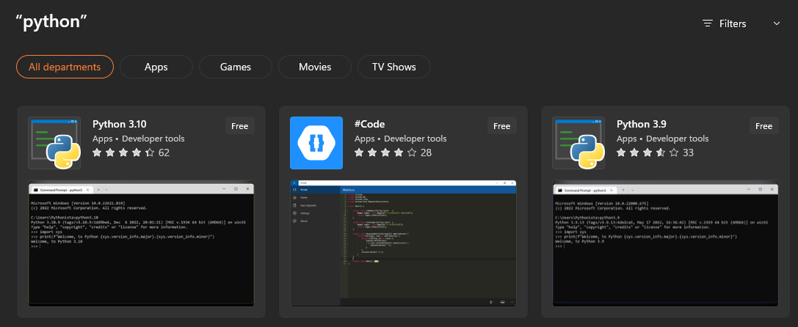
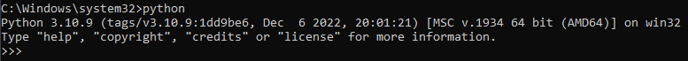

# Python and Kratos Installation
Most of the tools necessary for the course and project require to use python. The version necessary for the course is **Python 3.10**. We recommend installing it through the Microsoft Store, which will be explained in the following guide. Alternatively you can use Anaconda, although we prefer the following way for simplicity.

## **1. Python 3.10 Installation**
Go to the Microsoft Store and install Python 3.10 on your computer.



You can check whether Python has been successfully installed by using  “python” command in the command prompt. You should get the following output when you have successfully installed Python:



Use the `exit()` command to exit from the Python interpreter.


## **2. Python Packages Installation**
Install following Python packages using the commands below:

```console
python3.10 -m pip install scipy
python3.10 -m pip install matplotlib=3.5.3
python3.10 -m pip install ffmpeg
```

## **3. Enable the “long paths” handling**
Run a PowerShell window as administrator 

```console
Start-Process powershell -Verb runAs
```

and run the following two lines of code:

```console
New-ItemProperty -Path "HKLM:\SYSTEM\CurrentControlSet\Control\FileSystem"
`
-Name "LongPathsEnabled" -Value 1 -PropertyType DWORD -Force
```

You should get the following output:


## **4. Kratos Multiphysics Installation**
Kratos is installed as a Python package. It is important to install version 9.2.0. For that, you can run the following command:

```console
python3.10 -m pip install --upgrade --force-reinstall --no-cache-dir KratosMultiphysics-all==9.2.0
```
