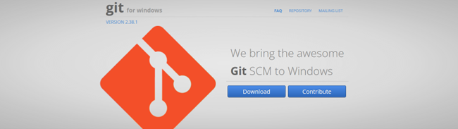
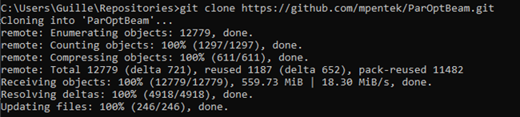

# ParOptBeam Installation Guide
This guide will explain how to install ParOptBeam and its dependencies

## 1. Git installation
Git is need to clone ParOptBeam from its repositories. Use [this link](https://gitforwindows.org/) to go to Git website and download Git. After the download is complete, open your the folder where you downloaded them and run the executable to install it. You can leave the default parameters during the setup.


## 2. Clone ParOptBeam
Clone the ParOptBeam repository in a folder of your choice. To do that, open the Command Prompt and navigate to the folder where you want to have the software. Use the following command:
```shell
$ git clone https://github.com/mpentek/ParOptBeam.git
```

You should see the following output in the terminal:


## 3. Test ParOptBeam
Open the folder where you have cloned the repositories in Visual Studio Code. There, you will find two files (“run_generic_models.py” and “run_generic_models_from_python.py”). You can whether everything works correctly by opening a terminal in VS Code and running them with the following command:
```shell
$ python run_generic_models.py
```

You will see extensive output, and at the end, some animations should pop up. If an **error regarding “FFMPEG” is raised**, it will be necessary to install the package manually. Follow this link to [FFMPEG installation guide](FFMPEG.md)

Follow the following link for an explaination on [how to use ParOptBeam](../ParOptBeam_Guide.md)

