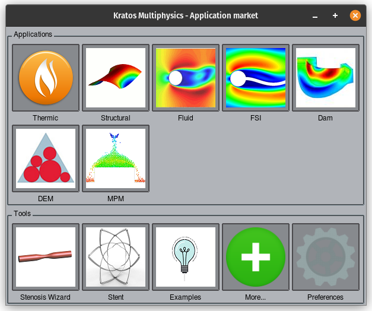
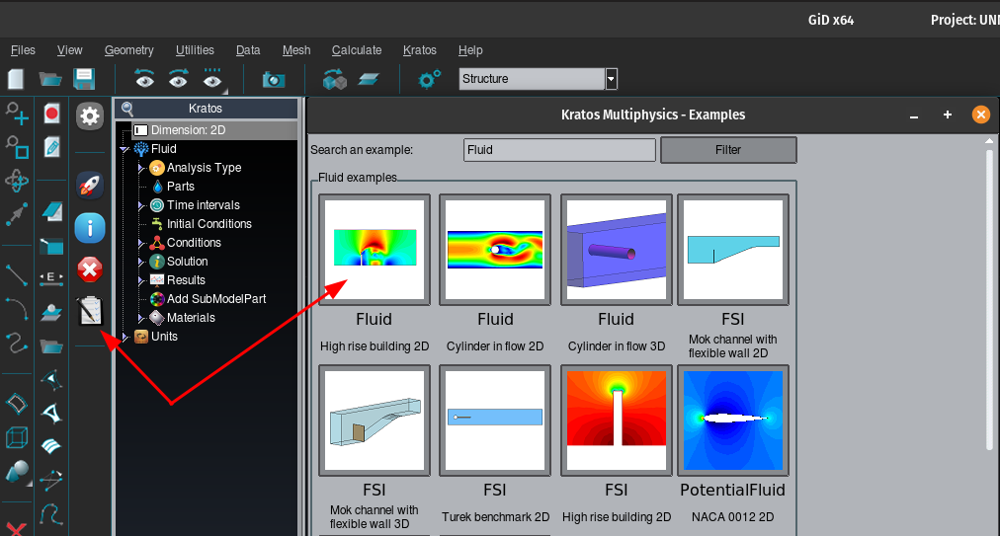
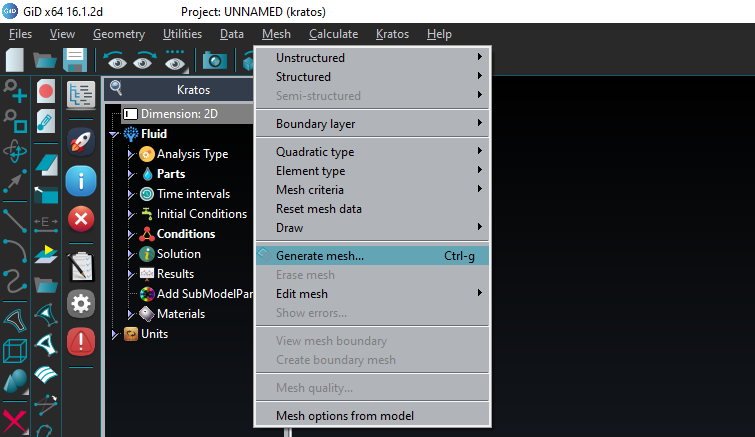
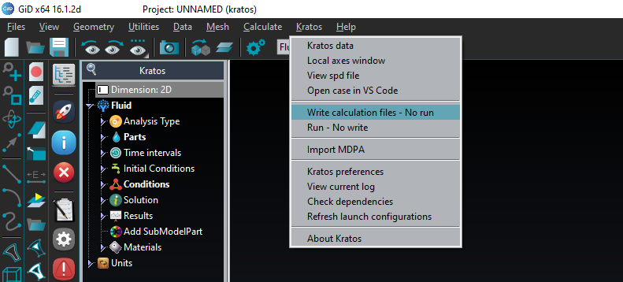
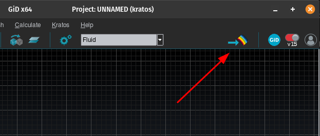

# Running an example with Kratos Multiphysics
Here we will give an example on how to run Kratos with GiD. 
## Model Preparation
The model that will be used in this example is pre-made. Follow the instructions below to load the model
### 1. Start the Kratos problem type:
In GiD, go to *“Data/Problem type/kratos”*. A window will pop up. Select *“Fluid”*, then *“Fluid”* again, and then *“2D”*.



### 2. Load the prepared example:
Click on the *notepad* icon on the left (*“Examples window”*), then open the example *“Fluid High rise building 2D”*.



### 3. Mesh the geometry:
Go to “Mesh/Generate mesh” and then click “OK”. Then you can click on “View mesh”.



**Save the project**. Click on “Files/Save as..” and save the project on a location of your choice.

### 4. Output the files for Kratos:
Click on “Kratos/Write calculation files – No run”. You will see that in your recently saved project a file called “ProjectParameters.json” and a “MainKratos.py” appear.



## Running Kratos Multiphysics
### 1. Open the project folder in VSC:
Open Visual Studio Code and click “File/Open Folder…”. Then select the folder where you saved your GiD project (the one ending in “.gid”).

### 2. Run the simulation:
Open a terminal in Visual Studio Code by clicking “Terminal/New Terminal”. Then execute the following command:
```shell
$ python MainKratos.py
```
You should see some time step information in the terminal, which means that the simulation is running.

### 3. Visualize results:
Once the simulation is completed, you can open again GiD and open the project you just saved. On the top-right corner, you should be able to click on “Toggle between pre and postprocess”.


