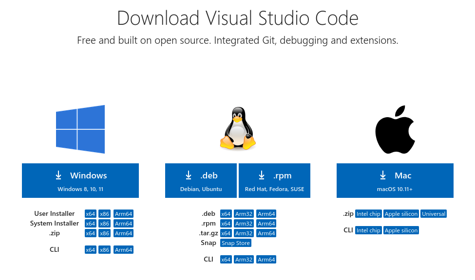
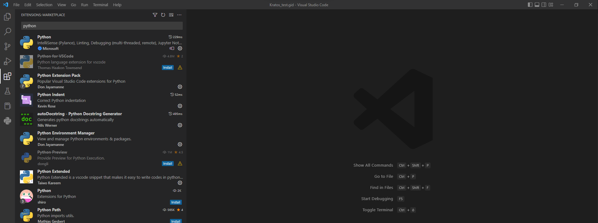

# Visual Studio Code
Visual Studio Code is a helpful IDE and code editor. It comes with built-in support for JavaScript, TypeScript and Node.js and has a rich ecosystem of extensions for other languages and runtimes (such as C++, C#, Java, Python, PHP, Go, .NET). 

## 1. Download and Install Visual Studio Code
You can download VSCode in the Microsoft Store if you're using Windows. Alternatively, you can download it on [their website here](https://code.visualstudio.com/Download){:target="_blank"}. Choose according to your operating system: 


Here are some [helpful videos to get started](https://code.visualstudio.com/docs/getstarted/introvideos){:target="_blank"}  using Visual Studio Code.

## 2. Add Python Path to Visual Studio Code
Make sure to **add Python to your path** if not already available in visual studio code integrated terminal. For Windows, the process will be as the following:

**Start menu &rarr; search for "Edit the system environment variables"**. Click on **"Environment Variables"**. Under **"System variables"** find **"Path"** and click on **Edit**. Press **"New"** to add the python location to the path. In case you installed python via the anaconda package, go to the install location of anaconda (in the users file by default) and copy its path. 

Also add the anaconda script path, which has the same path as anaconda, but with \Scripts added to it. For example:

- Anaconda Path: ```C:\Users\maxmustermann\anaconda3```
- Script Path: ```C:\Users\maxmustermann\anaconda3\Scripts```

## 3. Useful Extensions
In order to unlock some functions on Visual Studio Code and make the user experience easier, you can install extensions. 

To search for extensions, you can either click on the **Extensions** button on the left sidebar, or **(Ctrl + Shift + X)**.



There are plenty of them in the Extensions: Marketplace. Sometimes, when you have a file which you cannot open due to the missing extension, Visual Studio Code will recommend an extension which you can install in order to open the file. 

Some useful extensions for the course are the following:

For Python:
- **Python**
- *Python Environment Manager*
- *Python Extended*
- *Python Extension Pack*
- Python for VSCode
- Python-autopep8

For JSON:
- JSON Tools
- Prettify JSON

For Remote Computing:
- Remote SSH

Jupyter Notebook:
- Jupyter

## 4. Visual Studio Code Interface
The window of Visual Studio Code is split into:
- File explorer (*top side bar*): Where all the opened folders and their respective files are located. It is located on the left of the window. 

- Code editor (*center*): Located in the center of the window. The code of your file will be displayed here. In case you install extensions, you can also open different files, such as pdf, excel, word, etc.

- Terminal (*below code editor*): Located in the bottom part of the window, the terminal (also "command prompt" on windows), is used to run your code. 
  In case the terminal is not displayed, you can go to View &rarr; Terminal to open it.


## 5. Useful tips
To open the terminal, you can go to View &rarr; Terminal command. You can have multiple terminal simultaneously. To add more terminals, go to **Menu bar &rarr; Terminal &rarr; New Terminal** or press **(Ctrl + Shift + `)** on your keyboard.

To open a File/Folder, go to **File &rarr; Open File / Open Folder**. This will add it to the File Explorer, while removing the old folder from your File Explorer. In order to add a folder you should go to **File &rarr; Add Folder to Workspace"**.

You can run the python scripts directly by **right-click on script &rarr; "Run Python File in Terminal"** or type **"python.exe file_name.py"** in the terminal.

Save the updated scripts by clicking on script and then going to **"File &rarr; Save"**. You can also save all files by going to **"File &rarr; Save all"**

