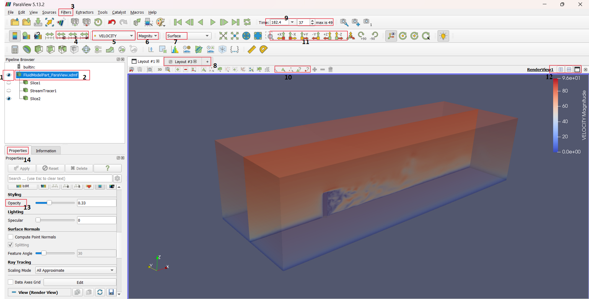
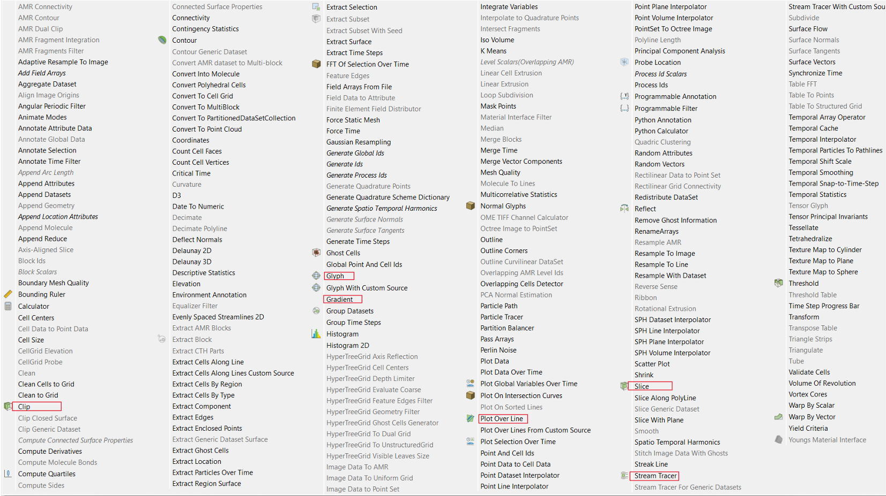

# Postprocessing
Upon finishing the simulation, the results should be processed in order to be comprehensibly displayed in the final report. This section provides the guidelines for postprocessing and is organized as follows

1. Preparation works for postprocessing in ParaView
2. Postprocessing with ParaView
3. Postprocessing with python
4. Input processing for ParOptBeam


___
## 1. Preparation works for postprocessing in ParaView

### 1.1 Including Cp values to the h5 files

The output results from Kratos will be in format .h5. This result does not contain coefficient of pressure values by default. So we should add it to visualize it in ParaView. To do that,

1. Add the script "add_cp_to_h5.py" to the directory "results" in your project. This file shall be found in the sample files we provided you. Take a look at the script, you should modify some values according to your simulation parameters.

2. Load the default Kratos version at the cluster:
```shell
$ startkratos
```
3. Run the following
```shell
$ python3 add_cp_to_h5.py
```

### 1.2 Convert H5 to Xdmf

ParaView can't read h5 files by default. In order to visualize the result, we need to generate an ".xdmf" file. Follow these steps to generate it:

1. Load the default Kratos version at the cluster if it is not already loaded (it has to be loaded every time we open a new terminal):
```shell
$ startkratos
```
2. Navigate to the folder where you have the h5 files with the "cd" command and create the ".xdmf" file by running:
```shell
$ convertH5toXdmf <name_of_files_until_dash>
```
3. An ".xdmf" file will be created. Copy all the h5 files and the xdmf file to your computer to visualize. 

**Note that the xdmf file only serves as a link between the ParaView and the h5 files. ParaView needs both the h5 and xdmf files.* 

## 2. Postprocessing in ParaView

After the files are ready to be read in ParaView, here a brief overview of how to use ParaView is given as two parts. 

1. User Interface of Paraview
2. Useful tools and settings in Paraview

### 2.1 User Interface of Paraview

Refer to the figure and the numbered items (in clockwise direction)



1. **File Handling**

    2  - This is pipeline browser which displays the files you have opened and their downstream pipelines (will be explained later)         
    1  - The files that are currently visualized will have the eye icon enabled   
    8  - Layout management and creation. Here Multiple layouts shall be managed. New layouts are created on clicking the '+' icon. While creating new layouts, multiple options are available, such as render view and spreadsheet (will display nodal and elemental variables in spreadsheet form)     
    12 - Using this you can open multiple adjacent screens for viewing models   

2. **Viewing Tools**

    11 - Here, predefined visual orientation options shall be selected      
    7  - Here, different model rendering options like surface, surface with edges, etc shall be selected. In this, Surface LIC will be useful rendering. Apply it on sliced surfaces for smoother handling.      
    10 - Select this Hover Points/Shells and Hover over model to see the elemental or nodal values like Velocity or Pressure    

3. **Visualization Variables**

    5  - Variables such as PRESSURE, VELOCITY, and others, which you have defined in the output process of the project parameters file in Kratos, shall be selected here for visualization     
    6  - Specify the direction of a vector variable. If the selected variable is not a vector, then the option will not be enabled, like for PRESSURE     
    4  - 1. Manual modification to the visualization coloring scale     
&nbsp;&nbsp;&nbsp; - 2. Automatic recalculation of the visualization coloring scale based on entire time step values     
&nbsp;&nbsp;&nbsp; - 3. Automatic recalculation of the visualization coloring scale based on present time step values      
    9  - Select the time step that you want to visualize   

4. **Other Useful Tools**

    3  - In filters, multiple visualization tools can be selected. Useful tools are explained in next section     
    14 - For each tool, a separate properties panel will be created where you can alter visualizing options      
    13 - Opacity is an important property to adjust for the 3D fluid domain where you can adjust it to visualize inner objects     

### 2.2 Useful filtering tools and settings in Paraview


1. **ParaView → Edit → Settings → General**, search for “Cache” and tick “Cache Geometry For Animation” to speed up picture creation for animation.

2. **Animations:**
  - Using File → Save animation, you can create standalone JPG or PNG pictures for the results above.
  - Merge pictures into: GIF with the software of your choice **or/also** any video format with the software of your choice.

3. **Filtering Tools:**
Go to ParaView → Filters → Alphabetical, you would see the filters similar to figure below. Select the necessary filter (In this figure useful filtering tools are marked), which will appear in the downstream pipeline. Each filter will have a seperate properties panel which can been seen below pipeline browser. 



- **3.1 Slice & Clip:**  
    - This shall used in cases to slice out a specific part of the fluid domain   
    - In the properties panel,  
    -- Mention Slice type - Plane, box, etc   
    -- Set the dimensions of Plane/Box   
    -- Select/Unselect the Show Plane     
    - Slice & Clip are slightly different, which you would notice the difference when using it  
    
- **3.2 Glyph:**
    - Glyph is a form of vector visuvalisation  
    - In the properties panel, modify the variable and scale factor as needed  
  
- **3.3 Stream Tracer:**
    - Stream Tracer is used to generate streamlines of the flow  
    - In the properties panel, important parameters to set are  line parameters (Stream lines will be generated across this line), maximum streamline length and resolution  
    
- **3.4 Plot Over Line:**
    - Use this to Plot a variable like VELOCITY, over a line in the 3D Fluid Domain (Specify the line parameters in the properties panel)  

- **3.5 Contour:**
    - Creates contour of selected variable
- **3.6 Gradient:**
    - This calculates gradient, Q Criterion (it is used for visualizing vortexes). The calulated parameters can be visuvalised by creating a downstream filter with Contour. In the contour properties panel, set Q-values range of 0.2 - 0.01 1/s. [Reference link](https://discourse.paraview.org/t/qcriterion-in-paraview/2355)

4. **Notes**
  - For Pressure in Structural model part, same principles regarding creating slices and visualization as with the velocity     
  - Use a combination of filters like Slice + Glyph, etc., for more informative and smoother visualizations  


____
## 3. Postprocessing with python

The ["point_output_process"](Preprocessing.md#21-point-output-process) and ["line_output_process"](Preprocessing.md#22-line-output-process) that you have defined in ProjectParametersCustom.json generates an ascii output (.dat files), with time series of respective pressure and velocities. We recommend (and support) you to create your own python scripts with numpy and matplotlib to visualize the data. Here's an example of a python script to generate a simple plot of the pressure of a certain point:

```python
import numpy as np

import matplotlib.pyplot as plt

path = <path_to_the_file_including_the_me>

data = np.loadtxt(path)

time = data[:,0]

pressure = data[:,1]

plt.plot(time, pressure)
```

This script reads a certain ascii output (in this case: pressure output) and then splits the file in two variables (time and pressure). Time is the first column of the ascii file, while pressure the second column. Then you can plot both of them to create a plot with the time series of the pressure output of the simulation. Similarly, you can do the same for the global forces (base forces and moments). 

With Numpy, you also have useful commands, which can help you find mean, maximum values etc. Combine these different commands to extract the results of interest. Visit this page on [Matplotlib](https://matplotlib.org/) for more details of the features available to visualize your data.

Other softwares are also available, such as Excel or Matlab, however we recommend and support Python.

____
## 4. Input processing for ParOptBeam

The level forces from Kratos is the input for ParOptBeam. So it needs to be converted into a format that ParOptBeam understands, using the python script (**convert_kratos_to_paroptbeam.py**) that is available in the sample files we provided you. The script reads the level force file from the respective folder and converts them accordingly. For this, make sure that under `"n_level_files"` in the script, you input the [number of level forces received from the simulation](Preprocessing.md#23-force-output-process). You can also sample the level forces for the ParOptbeam format in more intervals than the current level forces, under `"number_of_sampling_interval_cases"`. Run the script to receive the level force output, which will then serve as an input for the CSD in ParOptBeam.

More details on setting up the beam model and the CSD parameters for ParOptBeam will be explained in [the next chapter](ParOptBeam_Guide.md).
