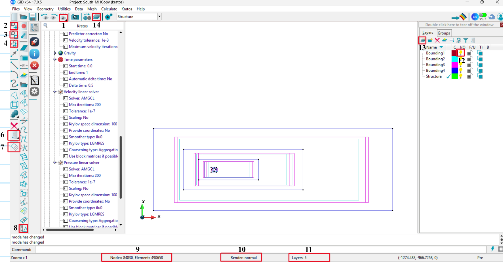

# GiD Modelling
This section provides the guidelines for Modelling in GiD and is organized as follows. 

1. Preparation works for modelling in GiD
2. Modelling in GiD
3. Outputs from GiD

An example file is available in Moodle, which can be downloaded under chapter *5-Computational Wind Engineering (CWE) → Example simulation of a Highrise with simulation results*. This download link contains the folder *CFD_HighRiseExampleFine*, which shows a prototype of a CFD simulation done in GiD + Kratos. It is very helpful to inspect this file and notice how the processes are implemented there.

## 1 Preparation works for modelling in GiD
Before modelling in GiD, it is necessary to gather essential information regarding the case study, which will be discussed below.

### 1.1 Wind profile, direction, etc.
The wind characteristics differ between each case study. Knowing the geographical position of the case study and its surroundings, you can manage to assess the main wind direction considered for the study and its respective velocity profile.

### 1.2 Geometry of the structure and bounding box
It is essential to inspect the geometry of the building for the case study, which will then be modelled in GiD. Necessary information, such as height, width, depth, openings or changes of the building geometry should be noted, in order to have an overview of how to model the building later. 

### 1.3 Sizing of the numerical wind tunnel (CFD domain size)
Make sure that your CFD domain size is correct. *CFDGuidelines* from chapter *5- Computational Wind Engineering* shows how to define the size of the domain depending on the case study. For better meshing, it is advised to use 3 to 4 bounding boxes covering the entire domain. The parts close to the structure should have a finer mesh, in comparison to parts away from the structure, where the information received from the simulation is not of such importance.

The calculation of the outermost bounding box (domain) dimensions is provided in the PPT. Now, inner bounding boxes need to be created by progressively dividing the space in half. For example, if the outer box is positioned at 2400 and the structure's outer surface is at 0, then: The 1st inner bounding box should be at 1200. The 2nd inner bounding box should be at 600. And so on, continuing this pattern.  

___
## 2 Modelling in GiD

### 2.1 Create geometrical model
Firstly, make sure to place your structure base centered on (0.0, 0.0, 0.0) and use x – streamwise, z – height, y –spanwise as directions. Strongly recommended that the fluid goes in x positive direction. Always follow hierarchical order of nodes, lines, surfaces, volumes in creating the model to avoid errors. 

1. Based on the building dimensions, create a list of x, y, z coordinates of the building and its bounding box. With this list, create nodes in GiD by selecting Geometry - Create - Point. Then in the command line enter the coordinates of the building. 

2. Select Geometry → Create → Lines, to create edges of structure and bounding box by the joining appropriate nodes. 

3. Select Geometry → Create → Surface, to create surfaces of structure and bounding box by selecting appropriate lines.  
**Note:** Surfaces are always closed. Hence, only a set of closed lines can form a surface. Don't create surface for building bottom as it is not physically meaningful and will produce error in simulation.  

4. Select Geometry → Create → Volume, to create volumes of fluid domain(bounding box) by selecting appropriate surfaces.  
**Note:** Volumes are always closed. Hence a set of closed surfaces can only produce a volume. If this is not followed, GiD will not raise error but the solution will not converge because we are having a open domain without BC.  

### 2.2 Create Layers
It is advised to work with layers. Create layers for the structure and for each bounding box.  
**How to create:** Create layers by selecting "create a new layer". Then by, right click → send to → (Points, Lines, Surfaces, Volumes). Then select the entities that has to be added to the layer.   

### 2.3 Create groups
Group the respective geometric entities and assign the corresponding boundary conditions. Refer to the '5 - Computational Wind Engineering' tutorial video for instructions on creating groups. 

Make sure to have the following groups:

| Groups | Parts |
| ------ | ----- |
| Structure | All the surfaces of the structure. The bottom part of the structure should be hollow, meaning there is no surface for it, only the sides and the top. |
| Bottom Wall | Bottom surface of the CFD domain. Since the bottom of the structure is hollow, the bottom wall is a rectangular surface with an opening where the structure is positioned. |
| Top Wall | Top surface of the domain. |
| Side Walls | Both side surfaces of the domain. |
| Inlet | Surface, in which the wind is incoming (windward). |
| Outlet | Surface opposite to the inlet (leeward). |
| Fluid | All volumes of fluid. |

Boundary Conditions:

| Boundary Conditions | Groups |
| ------------------- | ------ |
| Slip boundary condition | Top Wall & Side Walls |
| NoSlip boundary condition | Bottom Wall & Structure |
| Prescribed velocity field | Inlet |
| Zero pressure field | Outlet |

### 2.4 Assign project parameters

Set the problem type by navigating to Data → Problem Type → Kratos → Fluid → Fluid → 3D. In the left-side panel, start assigning the project parameters for the problem. Since GiD offers limited user control over project parameters, only the essential parameters will be set within the GiD interface. Additional project parameter configurations will be handled outside GiD, as explained in Section 3 

Set the analysis type and all other parameters as shown in the tutorial video, except for the following:

**2.4.1. Time Intervals:**  
For this project, the total simulation time must be divided into two parts.  
        - Rampup Time Interval  
        - Run Time Interval  
    
**Rampup Time Interval:** During this phase, the inlet velocity of the domain is increased linearly from 0 to U over a time period 2T, where T = 1/f, f is the vortex shedding frequency. This phase is referred to as the ramp-up period. 

**Runtime Interval:** After the ramp-up phase, the flow is allowed to stabilize for an additional time period T. Thus, a total of 2T (ramp-up + stabilization) is allocated before data collection begins. Once the flow is stabilized, the simulation should continue for 16T, during which measurements such as pressure, velocity, and other parameters are recorded   

Total Time Interval = 2T + 2T + 16T = 20T

**Steps in GiD Interface:** In the GiD interface, right-click on “Time Intervals.” Select “Create New Interval.” Create two separate time intervals corresponding to the ramp-up and run phases. Set the appropriate start and end times for each interval as per the calculated values.

**2.4.2 Automatic Inlet Velocity:**  
Since wind velocity varies with height, it must be defined as a function of height (z). Use the Eurocode corresponding to the project’s terrain category to calculate the wind profile function for your model. During the ramp-up time period, the inlet wind velocity also changes with time (t). Therefore, two separate functions must be defined for the inlet velocity:  

**Ramp-up Interval:** Wind velocity varies with both height (z) and time (t). 

**Run Interval:** Wind velocity varies only with height (z).  

**Steps in GiD Interface:** Double-click on “Automatic Inlet Velocity.” Check the box “By Function.” Enter the wind velocity profile: For the ramp-up interval, input the function that varies with both z and t. For the run interval, input the function that varies with z only. Assign each function to its corresponding time interval.

**Caution:** Before assigning, test the velocity functions in Excel or Python to ensure they behave as expected.

**2.4.3 Time Step:**  
The time step (Δt) for the simulation must be determined based on the Courant–Friedrichs–Lewy (CFL) number. The time step should be chosen such that CFL < 1  

CFL = U * dT / dX.  
U - Flow Velocity  
dT - Time step  
dX - Minimum mesh size  

Refer to the lecture for explanation on CFL number. Here velocity of the model is fixed. The mesh size is calculated based on structures dimension. Hence, by applying velocity, mesh size to the CFL formula and equating it to 1, calculate the step size.  

### 2.5 Meshing

**Mesh Size Calculation:**  Take the shortest side of the building and divide it by 10. This gives an approximate minimum mesh size for the building. As you move toward the outer bounding box, multiply the mesh size by 2 at each step.  

**How to assign mesh size:**  Refer to the tutorial video for guidance on assigning mesh sizes. Use layers to properly select and assign mesh sizes for specific regions of the model. Generate the mesh only after assigning all necessary project parameters.  

**Review Mesh quality:** Go to Mesh → Mesh Quality to check the different mesh quality parameters. In the quality criteria, select Minimum Edge to verify the minimum mesh size. With this mesh size, check the CFL number to ensure it is below 1 for simulation stability.

### 2.6 Useful tools

Some of the essential GiD tools are categorized below. Refer to the figure and the numbered items (anticlockwise direction) for reference  

1. **Viewing tools**  
    1 - List of views  
    2 - Zoom in to specific region  
    3 - Automatically zooms to the frame covering the entire model    
    4 - Rotate and set the desired 3D view  
    6 - Give information(node id, coordinates, etc) for a single or list of entities(Points, lines, etc).   
    10 - Rendering

2. **Layer Handling**  
    14 - Enable and disable Layer and Gropus tab  
    13 - Creates new layer   
    12 - Turn on and off the desired layer. If "Yellow" turned on    
    11 - Infromation about layers  

3. **Meshing**  
    7 - Turn on and off the mesh view  
    8 - Draws the mesh size data on the model  
    9 - Model and mesh detialls  

4. **Additional Useful Commands:**
- **Menu bar &rarr; Utilities → Repair model**. This command checks and fixes modelling errors.
- **GiD → Geometry → Edit → Collapse → Model**. This deletes unnecessary (and perhaps hidden) lines and nodes. It is helpful especially when importing geometries from programms such as Autocad, Rhino and Sketchup, by exploding or ungrouping the geometry.

### 2.7 Run the preliminary (test) simulation 
Before running the full simulation, a good way to determine if everything has been defined correctly is to run the simulation from GiD for 3-5 time steps to make sure it runs. To see if it is running you can check GiD → Calculate → View process info. If the simulation is running for 3-5 time steps, it means that there are no errors in modelling and definition of the simulation of parameters.

___
## 3. Outputs from GiD
After completing the modelling of the structure in GiD, you can go to *Kratos&rarr;Write calculation files - No run*. This will generate several files, among which the following four are essential for running the simulation

1. **MainKratos.py** - File from which you run the simulation
2. **file_name.mdpa** - Contains mesh information of the model
3. **ProjectParameters.json** - File where you define new processes, which will be described here. The processes are necessary to define and extract information of interest from your simulation
4. **FluidMaterials.json** - File containing fluid properties

Although the problem can be directly solved by Kratos in GiD, the main reason for generating only the project files is as follows 

1. As the simulations demand significant computational power, a remote connection to the cluster of the Chair of Structural Analysis is provided where the simulations are executed.
2. GiD provides comparatively limited user control over modeling options and output parameter settings when compared to directly working with the ProjectParameter file. 

